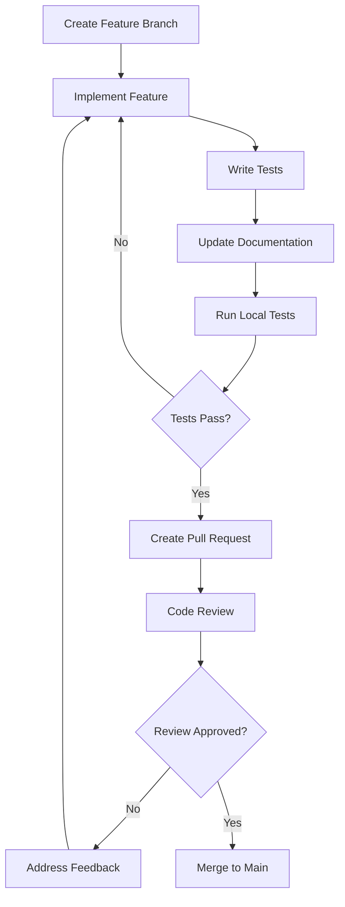

# Agent Zero Developer Guide

Complete guide for developers contributing to and extending Agent Zero.

## Quick Start for Developers

### Prerequisites
- **Python 3.11+** with type hints support
- **Git** for version control
- **Docker** for containerized development
- **ClickHouse** instance for testing

### Development Setup

```bash
# Clone the repository
git clone https://github.com/maruthiprithivi/agent_zero.git
cd agent_zero

# Create virtual environment
python -m venv .venv
source .venv/bin/activate  # On Windows: .venv\Scripts\activate

# Install development dependencies
pip install -e ".[dev]"

# Install pre-commit hooks
pre-commit install

# Run tests to verify setup
pytest
```

## Architecture Overview

Agent Zero follows a modular, layered architecture:

```
┌─────────────────────────────────────────┐
│              Client Layer               │
│  (IDE Integrations, REST API, CLI)     │
├─────────────────────────────────────────┤
│              Service Layer              │
│   (MCP Server Core, Tool Registry)     │
├─────────────────────────────────────────┤
│           Business Logic Layer          │
│ (MCP Tools, AI Diagnostics, Monitoring)│
├─────────────────────────────────────────┤
│              Data Layer                 │
│      (ClickHouse Client & Database)     │
├─────────────────────────────────────────┤
│           Infrastructure Layer          │
│    (Storage, Cloud Providers, Metrics) │
└─────────────────────────────────────────┘
```

### Key Components

| Component | Responsibility | Location |
|-----------|---------------|----------|
| **MCP Server Core** | Protocol handling, tool routing | `agent_zero/server/core.py` |
| **Tool Registry** | MCP tool management and discovery | `agent_zero/server/tools.py` |
| **AI Diagnostics** | Machine learning analysis | `agent_zero/ai_diagnostics/` |
| **Monitoring Systems** | Performance and health monitoring | `agent_zero/monitoring/` |
| **Configuration** | Unified configuration management | `agent_zero/config/` |
| **Client Layer** | ClickHouse database connectivity | `agent_zero/server/client.py` |

## Project Structure

```
agent_zero/
├── agent_zero/                    # Main Python package
│   ├── __init__.py                # Package initialization
│   ├── main.py                    # CLI entry point
│   ├── config/                    # Configuration management
│   │   └── unified.py             # Unified configuration system
│   ├── server/                    # MCP server implementation
│   │   ├── core.py                # Server core and initialization
│   │   ├── tools.py               # MCP tool registration
│   │   ├── client.py              # ClickHouse client management
│   │   └── errors.py              # Error handling
│   ├── monitoring/                # Monitoring and analytics
│   │   ├── profile_events_core.py # ProfileEvents analysis
│   │   ├── performance_diagnostics.py # Performance analysis
│   │   └── ...                    # Other monitoring modules
│   ├── ai_diagnostics/            # AI-powered analysis
│   │   ├── bottleneck_detector.py # ML bottleneck detection
│   │   ├── pattern_analyzer.py    # Pattern recognition
│   │   └── performance_advisor.py # AI recommendations
│   └── utils.py                   # Utility functions
├── tests/                         # Test suite
│   ├── unit/                      # Unit tests
│   ├── integration/               # Integration tests
│   └── conftest.py               # Test configuration
├── docs/                          # Documentation
├── configs/                       # IDE configuration templates
├── docker/                        # Docker files
├── scripts/                       # Utility scripts
└── pyproject.toml                 # Project configuration
```

## Development Standards

### Code Quality Requirements
1. **Type Safety**: All functions must have comprehensive type hints
2. **Documentation**: Public APIs must have docstrings following Google style
3. **Testing**: Minimum 80% code coverage for new features
4. **Performance**: Consider performance implications of all changes
5. **Security**: Follow security best practices and use security scanning

### Code Style Guidelines
- Follow the project's CLAUDE.md guidelines
- Use UnifiedConfig for all configuration (not ClickHouseConfig/ServerConfig)
- Import from `agent_zero.server` (not `agent_zero.mcp_server`)
- All MCP tools must use `@trace_mcp_call` decorator
- Error handling: catch specific exceptions, log with context, re-raise as MCPToolError

### Quality Tools
```bash
# Linting with Ruff
ruff check agent_zero/

# Formatting with Black
black agent_zero/

# Type checking with MyPy
mypy agent_zero/

# Security scanning with Bandit
bandit -r agent_zero/

# Run all quality checks
pre-commit run --all-files
```

## Development Workflows

### Feature Development


### Testing Strategy
```bash
# Run specific test categories
pytest -m unit                    # Unit tests only
pytest -m integration            # Integration tests only

# Run with coverage
pytest --cov=agent_zero --cov-report=html

# Run performance tests
pytest tests/load/ -v --durations=10
```

## Contributing Guidelines

### Pull Request Process
1. **Single Responsibility**: Each PR should address a single concern
2. **Backward Compatibility**: Maintain API compatibility unless breaking changes are necessary
3. **Documentation**: Update documentation for all user-facing changes
4. **Testing**: Include tests for all new functionality and bug fixes
5. **Code Review**: All changes require review and approval

### Branch Naming
- `mp/feature-description` or `feature/description` for features
- `bugfix/issue-description` for bug fixes
- `docs/update-description` for documentation updates

### Commit Messages
Follow conventional commit format:
```
feat: add new bottleneck detection algorithm
fix: resolve memory leak in cache manager
docs: update API documentation for monitoring tools
test: add integration tests for AI diagnostics
```

## Testing Framework

### Test Categories
- **Unit Tests**: Test individual components and functions
- **Integration Tests**: Test component interactions
- **Load Tests**: Performance and stress testing
- **Security Tests**: Security scanning and vulnerability testing

### Test Configuration
```python
# conftest.py provides shared fixtures
@pytest.fixture
def mock_clickhouse_client():
    """Mock ClickHouse client for testing."""
    pass

@pytest.fixture
def sample_config():
    """Sample configuration for testing."""
    pass
```

### Running Tests
```bash
# All tests
pytest

# Specific test file
pytest tests/test_monitoring.py

# Specific test function
pytest tests/test_monitoring.py::test_performance_analysis

# With verbose output
pytest -v

# With coverage
pytest --cov=agent_zero --cov-report=term-missing

# Using Docker test runner
./scripts/run-tests.sh
```

## Creating Custom MCP Tools

### Tool Structure
```python
from agent_zero.server.tools import trace_mcp_call
from agent_zero.server.errors import MCPToolError

@trace_mcp_call
async def custom_analysis_tool(
    analysis_type: str = "performance",
    time_range: str = "1h"
) -> dict:
    """Custom analysis tool with AI insights.

    Args:
        analysis_type: Type of analysis to perform
        time_range: Time range for analysis

    Returns:
        Analysis results with recommendations

    Raises:
        MCPToolError: If analysis fails
    """
    try:
        # Tool implementation
        results = await perform_analysis(analysis_type, time_range)
        return {
            "status": "success",
            "results": results,
            "recommendations": generate_recommendations(results)
        }
    except Exception as e:
        raise MCPToolError(f"Analysis failed: {e}") from e
```

### Tool Registration
```python
# In agent_zero/server/tools.py
from .monitoring.custom_tools import custom_analysis_tool

# Register in the tool list
ALL_TOOLS = [
    # ... existing tools
    custom_analysis_tool,
]
```

## AI Diagnostics Development

### Adding New AI Models
```python
# In agent_zero/ai_diagnostics/
class CustomPredictor:
    """Custom ML predictor for performance analysis."""

    def __init__(self, config: dict):
        self.config = config
        self.model = self._load_model()

    def predict(self, data: dict) -> dict:
        """Make predictions on performance data."""
        # Model implementation
        pass

    def _load_model(self):
        """Load or train the ML model."""
        pass
```

### Integration with Monitoring
```python
from agent_zero.ai_diagnostics import CustomPredictor

@trace_mcp_call
async def ai_performance_prediction(time_range: str = "24h") -> dict:
    """AI-powered performance prediction."""
    data = await collect_performance_data(time_range)
    predictor = CustomPredictor(config)
    predictions = predictor.predict(data)

    return {
        "predictions": predictions,
        "confidence": predictions.get("confidence", 0.0),
        "recommendations": generate_recommendations(predictions)
    }
```

## Performance Optimization

### Best Practices
1. **Async/Await**: Use async operations for I/O bound tasks
2. **Connection Pooling**: Reuse database connections
3. **Caching**: Implement intelligent caching strategies
4. **Batch Operations**: Group similar operations together
5. **Memory Management**: Monitor memory usage and implement cleanup

### Profiling Tools
```bash
# Profile performance
python -m cProfile -o profile.prof -m agent_zero.main

# Analyze profile
python -c "
import pstats
p = pstats.Stats('profile.prof')
p.sort_stats('cumulative').print_stats(10)
"

# Memory profiling
pip install memory-profiler
python -m memory_profiler agent_zero/main.py
```

## Deployment & Release

### Build Process
```bash
# Build distributions
python -m build --sdist --wheel

# Check distributions
twine check dist/*

# Upload to PyPI (test)
twine upload --repository testpypi dist/*

# Upload to PyPI (production)
twine upload dist/*
```

### Docker Development
```bash
# Build development image
docker build -f docker/Dockerfile.dev -t agent-zero:dev .

# Run development container
docker run -it --rm -v $(pwd):/app agent-zero:dev bash

# Run tests in container
docker run --rm -v $(pwd):/app agent-zero:dev pytest
```

### CI/CD Pipeline
The project uses GitHub Actions for:
- **Quality Checks**: Linting, formatting, type checking
- **Testing**: Unit, integration, and security tests
- **Build**: Package building and distribution
- **Deployment**: Automated releases to PyPI

## Debugging & Troubleshooting

### Local Development
```bash
# Enable debug logging
export LOG_LEVEL=DEBUG

# Run with verbose output
ch-agent-zero --log-level DEBUG

# Enable MCP tracing
export AGENT_ZERO_ENABLE_MCP_TRACING=true
```

### Common Development Issues

| Issue | Symptom | Solution |
|-------|---------|----------|
| **Import Errors** | `ModuleNotFoundError` | Install in development mode: `pip install -e .` |
| **Type Errors** | MyPy failures | Add type hints and resolve type issues |
| **Test Failures** | CI/CD failures | Run tests locally and fix issues |
| **Linting Errors** | Pre-commit failures | Run `pre-commit run --all-files` |

## Getting Help

### Development Support
- **GitHub Discussions**: Ask questions in [GitHub Discussions](https://github.com/maruthiprithivi/agent_zero/discussions)
- **Issues**: Report bugs in [GitHub Issues](https://github.com/maruthiprithivi/agent_zero/issues)
- **Code Review**: Request review in pull requests

### Documentation
- **API Reference**: Generated from code docstrings
- **Architecture Docs**: Detailed technical documentation
- **Examples**: Practical examples in `examples/` directory
- **Testing Docs**: Testing guidelines and best practices

## Release Process

### Semantic Versioning
- **Major** (1.0.0): Breaking changes
- **Minor** (0.1.0): New features, backward compatible
- **Patch** (0.0.1): Bug fixes, backward compatible

### Release Steps
1. **Update CHANGELOG.md** with new version details
2. **Create release branch** from main
3. **Update version** in pyproject.toml
4. **Run full test suite** to ensure quality
5. **Create pull request** for release branch
6. **Tag release** after merge to main
7. **Automated CI/CD** handles building and publishing

### Release Automation
```bash
# Create and push release tag
git tag v1.0.0
git push origin v1.0.0

# GitHub Actions automatically:
# 1. Runs full test suite
# 2. Builds packages
# 3. Publishes to PyPI
# 4. Creates GitHub release
```

## Next Steps

1. **Set up your development environment** following the setup guide above
2. **Read the architecture documentation** to understand system design
3. **Explore the codebase** starting with `agent_zero/server/core.py`
4. **Run the test suite** to ensure everything works correctly
5. **Pick your first contribution** from [Good First Issues](https://github.com/maruthiprithivi/agent_zero/labels/good%20first%20issue)

Ready to contribute? Join our community and help make Agent Zero even better!

---

For user documentation, see [USER_GUIDE.md](USER_GUIDE.md).
For deployment information, see [DEPLOYMENT.md](DEPLOYMENT.md).
