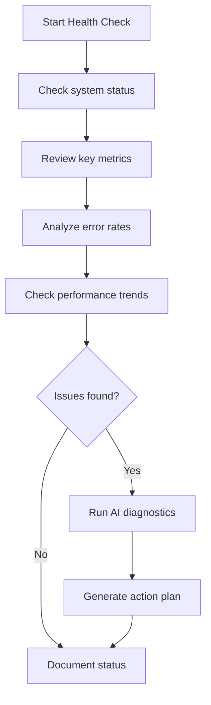
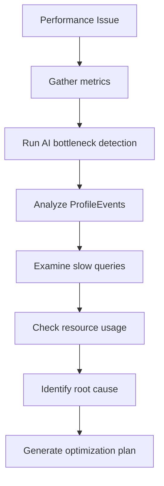
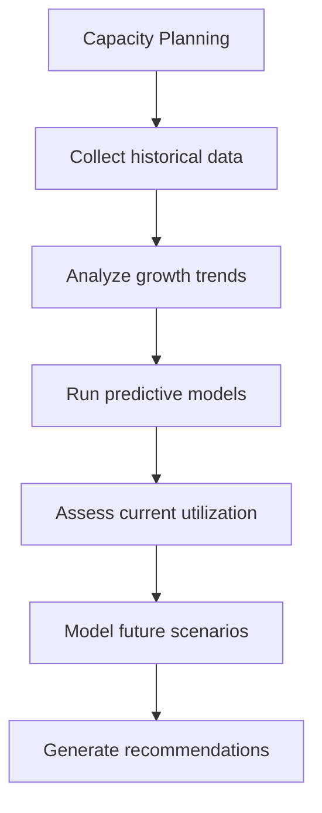

# Agent Zero User Guide

Complete guide for using Agent Zero for ClickHouse database monitoring, analytics, and optimization.

## Overview

Agent Zero provides **66+ specialized MCP tools** across these categories:

| Category | Tools | Description |
|----------|-------|-------------|
| **Database Operations** | 4 | Database and table management |
| **Query Performance** | 8 | Query analysis and optimization |
| **Resource Monitoring** | 5 | System resource tracking |
| **Error Analysis** | 4 | Error investigation and troubleshooting |
| **Insert Operations** | 6 | Data ingestion monitoring |
| **Parts & Merges** | 6 | Storage optimization |
| **System Components** | 7 | Component health monitoring |
| **Table Statistics** | 5 | Table-level analytics |
| **Utility Tools** | 4 | Maintenance and utilities |
| **ProfileEvents** | 8 | Comprehensive event analysis |
| **Storage & Cloud** | 4 | Cloud storage optimization |
| **AI Diagnostics** | 7 | Machine learning insights |

## Getting Started

### Quick Installation

```bash
# Install with uv (recommended)
curl -LsSf https://astral.sh/uv/install.sh | sh
uv pip install ch-agent-zero

# Or install with pip
pip install ch-agent-zero
```

### Configuration

Set your ClickHouse connection details:

```bash
export CLICKHOUSE_HOST=your-clickhouse-host
export CLICKHOUSE_USER=your-username
export CLICKHOUSE_PASSWORD=your-password
```

### IDE Setup

**Claude Desktop** - Add to `claude_desktop_config.json`:
```json
{
  "mcpServers": {
    "agent-zero": {
      "command": "ch-agent-zero",
      "env": {
        "CLICKHOUSE_HOST": "your-host",
        "CLICKHOUSE_USER": "your-user",
        "CLICKHOUSE_PASSWORD": "your-password"
      }
    }
  }
}
```

## Core Functions

### 🏢 Database Operations

**Managing databases and tables:**
```bash
"List all databases and their sizes"
"Show table schema for user_events"
"Analyze table distribution across cluster"
"Get database metadata and statistics"
```

### 🚀 Query Performance Analysis

**Optimizing query performance:**
```bash
"Show the top 10 slowest queries from the last 24 hours"
"Analyze query execution plans and suggest optimizations"
"Compare query performance before and after index changes"
"Identify queries with high CPU or memory usage"
```

### 📊 Resource Monitoring

**Tracking system resources:**
```bash
"Show current CPU, memory, and I/O utilization"
"Monitor connection pool usage and thread activity"
"Analyze disk space usage across all volumes"
"Track network bandwidth and connection patterns"
```

### 🔍 Error Analysis

**Investigating and troubleshooting errors:**
```bash
"Show recent errors categorized by type and frequency"
"Analyze error patterns and correlate with system events"
"Investigate connection timeouts and network issues"
"Generate error trend analysis and prevention strategies"
```

### 📈 Insert Operations

**Monitoring data ingestion:**
```bash
"Analyze insert performance and batch sizes"
"Monitor data ingestion rates and patterns"
"Identify insert bottlenecks and optimization opportunities"
"Track data compression ratios during inserts"
```

### 🔄 Parts & Merges

**Storage optimization:**
```bash
"Show merge activity and part statistics"
"Analyze storage fragmentation and optimization needs"
"Monitor background merge performance"
"Identify tables requiring manual optimization"
```

### 🤖 AI-Powered Diagnostics

**Machine learning insights:**
```bash
"Use AI to detect current performance bottlenecks"
"Generate predictive analytics for capacity planning"
"Get intelligent optimization recommendations with impact estimates"
"Analyze usage patterns and detect anomalies"
```

### ☁️ Storage & Cloud Analytics

**Cloud storage optimization:**
```bash
"Analyze S3 storage performance and costs"
"Monitor Azure Blob storage efficiency"
"Compare compression algorithms and their effectiveness"
"Optimize multi-cloud storage strategies"
```

## User Workflows

### Daily Health Check


**Commands:**
```bash
"Show me the current system health status with AI insights"
"Generate a daily health report with trend analysis"
"Check for any performance degradation in the last 24 hours"
```

### Performance Investigation


**Commands:**
```bash
"Analyze performance degradation and identify the root cause"
"Run comprehensive bottleneck detection with AI insights"
"Generate optimization recommendations with priority levels"
```

### Capacity Planning


**Commands:**
```bash
"Generate capacity planning recommendations based on usage trends"
"Predict storage and compute needs for the next 6 months"
"Analyze growth patterns and scaling requirements"
```

## User Personas

### 👨‍💼 Database Administrators

**Focus**: Health monitoring, performance optimization, capacity planning

**Essential Commands:**
```bash
"Show cluster health with detailed component status"
"Identify performance bottlenecks and optimization opportunities"
"Generate capacity planning report with scaling recommendations"
"Analyze recent merge activity and storage optimization needs"
```

### 👨‍💻 Developers

**Focus**: Query optimization, application performance, debugging

**Essential Commands:**
```bash
"Analyze query performance for my application in the last hour"
"Show ProfileEvents data for queries from my service"
"Compare performance impact of my recent code changes"
"Debug slow queries and get specific optimization suggestions"
```

### 📊 Data Engineers

**Focus**: Pipeline performance, storage optimization, ETL monitoring

**Essential Commands:**
```bash
"Monitor ETL pipeline performance and identify bottlenecks"
"Analyze data compression efficiency across different algorithms"
"Track insert operation performance and optimization opportunities"
"Generate storage cost optimization recommendations"
```

### 🔧 Site Reliability Engineers

**Focus**: System reliability, monitoring, incident response

**Essential Commands:**
```bash
"Set up comprehensive monitoring with alerting thresholds"
"Investigate system incidents with correlation analysis"
"Generate reliability metrics and availability reports"
"Analyze system trends and predict potential issues"
```

## Best Practices

### Performance Optimization
- Use AI diagnostics for automated bottleneck detection
- Regularly analyze ProfileEvents for performance insights
- Monitor merge activity and optimize table structures
- Track query performance trends over time

### Monitoring Setup
- Implement comprehensive health checks
- Set up appropriate alerting thresholds
- Use predictive analytics for proactive monitoring
- Regular capacity planning and scaling analysis

### Security & Operations
- Follow authentication and authorization best practices
- Implement proper backup and disaster recovery
- Monitor for suspicious activity and anomalies
- Regular security audits and compliance checks

## Troubleshooting

### Quick Diagnostics

First, run these commands to diagnose issues:

```bash
# Check Agent Zero installation
ch-agent-zero --version

# Validate configuration
ch-agent-zero --show-config

# Test ClickHouse connection
ch-agent-zero --test-connection

# Check system status
curl http://localhost:8505/health
```

### Common Issues

#### Installation Problems

**Issue: "command not found: ch-agent-zero"**
```bash
# Solution: Reinstall or add to PATH
pip install ch-agent-zero

# Or if using uv:
uv pip install ch-agent-zero

# Check installation
which ch-agent-zero
```

**Issue: Import errors or module not found**
```bash
# Solution: Install in development mode
pip install -e .

# Or reinstall completely
pip uninstall ch-agent-zero
pip install ch-agent-zero
```

#### Connection Issues

**Issue: "Connection refused" or "Can't connect to ClickHouse"**
```bash
# Check environment variables
echo $CLICKHOUSE_HOST
echo $CLICKHOUSE_USER

# Test direct connection
curl -u $CLICKHOUSE_USER:$CLICKHOUSE_PASSWORD \
     http://$CLICKHOUSE_HOST:8123/ping

# Common solutions:
export CLICKHOUSE_HOST=your-correct-host
export CLICKHOUSE_PORT=8123  # or 9000 for native
export CLICKHOUSE_SECURE=false  # if not using SSL
```

**Issue: "Authentication failed"**
```bash
# Check credentials
export CLICKHOUSE_USER=your-username
export CLICKHOUSE_PASSWORD=your-password

# Test authentication
curl -u $CLICKHOUSE_USER:$CLICKHOUSE_PASSWORD \
     "$CLICKHOUSE_HOST:8123/?query=SELECT%201"
```

#### Performance Issues

**Issue: Slow query responses**
```bash
# Check ClickHouse performance
export MCP_QUERY_TIMEOUT=60
export CLICKHOUSE_SEND_RECEIVE_TIMEOUT=300

# Monitor resource usage
ch-agent-zero --enable-metrics
curl http://localhost:8505/metrics
```

**Issue: High memory usage**
```bash
# Reduce cache size
export MCP_CACHE_SIZE=100
export MCP_CACHE_TTL=60

# Limit concurrent operations
export MCP_MAX_CONCURRENT_REQUESTS=10
```

### Error Messages Reference

| Error Pattern | Cause | Solution |
|---------------|-------|----------|
| **MCPToolError: Query execution failed** | ClickHouse query error | Check query syntax and permissions |
| **ConnectionTimeout: Connection timed out** | Network or server issues | Increase timeouts, check connectivity |
| **RateLimitExceeded: Too many requests** | Rate limiting threshold exceeded | Increase limits or reduce frequency |
| **PermissionDenied: Access denied** | Insufficient ClickHouse permissions | Grant necessary permissions |

### Performance Metrics to Monitor

| Metric | Alert Threshold | Command |
|--------|----------------|---------|
| **CPU Usage** | >80% sustained | `"Show CPU utilization with trend analysis"` |
| **Memory Usage** | >85% | `"Analyze memory usage patterns and recommendations"` |
| **Query Duration** | >1s average | `"Show query performance analysis with optimization suggestions"` |
| **Error Rate** | >5% | `"Analyze error patterns and provide resolution strategies"` |
| **Disk Usage** | >90% | `"Generate storage analysis and cleanup recommendations"` |

### Recovery Procedures

**Reset Configuration**
```bash
# Remove configuration files
rm ~/.config/agent_zero/config.json
rm .env

# Reconfigure from scratch
ch-agent-zero --configure
```

**Clear Cache**
```bash
# Clear application cache
rm -rf ~/.cache/agent_zero/

# Restart with fresh cache
ch-agent-zero --clear-cache
```

## Advanced Features

### ProfileEvents Analysis
```bash
"Analyze ProfileEvents data for detailed performance insights"
"Show ProfileEvents trends across different query types"
"Generate ProfileEvents report for capacity planning"
```

### AI-Powered Insights
```bash
"Use machine learning to detect unusual patterns in database usage"
"Generate predictive analytics for performance and capacity"
"Get AI-powered optimization recommendations with confidence scores"
```

### Multi-Cloud Storage
```bash
"Analyze performance across different cloud storage providers"
"Compare costs and performance of S3 vs Azure storage"
"Generate multi-cloud optimization strategies"
```

## Getting Help

- **Search**: Use natural language to describe what you want to analyze
- **Examples**: Check the examples above for common use cases
- **Documentation**: See [DEVELOPER_GUIDE.md](DEVELOPER_GUIDE.md) for technical details
- **Support**: Report issues at [GitHub Issues](https://github.com/maruthiprithivi/agent_zero/issues)
- **Community**: Join discussions at [GitHub Discussions](https://github.com/maruthiprithivi/agent_zero/discussions)

---

For deployment and production setup, see [DEPLOYMENT.md](DEPLOYMENT.md).
For development and contributing, see [DEVELOPER_GUIDE.md](DEVELOPER_GUIDE.md).
