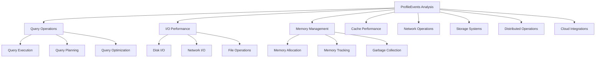

# Agent Zero - ClickHouse MCP Server

<div align="center">
  

  <h3>🚀 AI-Powered ClickHouse Monitoring & Analytics</h3>

  [](https://opensource.org/licenses/MIT)
  [](https://www.python.org/downloads/)
  [](https://clickhouse.com/)
  [](https://hub.docker.com/r/maruthiprithivi/agent-zero)
  [](deployment/kubernetes.md)
</div>

## Welcome to Agent Zero Documentation

Agent Zero is the most comprehensive **Model Context Protocol (MCP) server** for ClickHouse database monitoring, analytics, and management. Built with enterprise-grade reliability and AI-powered insights, it provides **66+ specialized tools** for complete database observability.

### 🎯 What is Agent Zero?

Agent Zero bridges the gap between **AI assistants** and **ClickHouse databases**, enabling natural language database operations, real-time performance monitoring, and intelligent optimization recommendations. Whether you're a developer, DBA, or data engineer, Agent Zero transforms how you interact with ClickHouse.

## ✨ Key Features

=== "🤖 AI-Powered Analysis"

    - **Machine Learning Bottleneck Detection** with confidence scoring
    - **Predictive Performance Analysis** and capacity planning
    - **Intelligent Optimization Recommendations** with impact assessment
    - **Pattern Recognition** for anomaly detection and trend analysis

=== "📊 Comprehensive Monitoring"

    - **400+ ProfileEvents** analysis across 25+ categories
    - **Real-time Performance Metrics** with historical trending
    - **Resource Utilization Tracking** (CPU, memory, I/O, network)
    - **Query Performance Analysis** with execution optimization

=== "☁️ Storage & Cloud Analytics"

    - **S3 Performance Analysis** with cost optimization insights
    - **Azure Blob Storage** integration and monitoring
    - **Compression Efficiency Analysis** with algorithm recommendations
    - **Multi-cloud Storage Optimization** strategies

=== "🔧 Production Ready"

    - **Enterprise Security** with authentication and encryption
    - **High Availability** with clustering and failover
    - **Comprehensive Monitoring** with Prometheus and Grafana
    - **Docker & Kubernetes** deployment ready

## 🚀 Quick Start

Get started with Agent Zero in minutes:

=== "🐍 Python pip"

    ```bash
    # Install Agent Zero
    pip install ch-agent-zero

    # Set environment variables
    export CLICKHOUSE_HOST=your-clickhouse-host
    export CLICKHOUSE_USER=your-username
    export CLICKHOUSE_PASSWORD=your-password

    # Run the server
    ch-agent-zero
    ```

=== "🐳 Docker"

    ```bash
    # Run with Docker
    docker run -d \
      --name agent-zero \
      -p 8505:8505 \
      -e CLICKHOUSE_HOST=your-host \
      -e CLICKHOUSE_USER=your-user \
      -e CLICKHOUSE_PASSWORD=your-password \
      ghcr.io/maruthiprithivi/agent-zero:latest
    ```

=== "☸️ Kubernetes"

    ```bash
    # Deploy to Kubernetes
    helm repo add agent-zero https://charts.agent-zero.example.com
    helm install agent-zero agent-zero/agent-zero \
      --set clickhouse.host=your-host \
      --set clickhouse.user=your-user \
      --set clickhouse.password=your-password
    ```

=== "🔧 IDE Setup"

    Configure your IDE for seamless integration:

    ```json
    // Claude Desktop configuration
    {
      "mcpServers": {
        "agent-zero": {
          "command": "ch-agent-zero",
          "env": {
            "CLICKHOUSE_HOST": "your-host",
            "CLICKHOUSE_USER": "your-user",
            "CLICKHOUSE_PASSWORD": "your-password"
          }
        }
      }
    }
    ```

!!! tip "First Time Setup"

    New to Agent Zero? Check out our [**Installation Guide**](getting-started/installation.md) and [**Quick Start Tutorial**](getting-started/quickstart.md) for detailed setup instructions.

## 🛠️ MCP Tools Overview

Agent Zero provides **66+ specialized MCP tools** organized into categories:

| Category | Tools | Description |
|----------|-------|-------------|
| **🏢 Database Operations** | 4 tools | Database and table management |
| **🚀 Query Performance** | 8 tools | Query analysis and optimization |
| **📊 Resource Monitoring** | 5 tools | System resource tracking |
| **🔍 Error Analysis** | 4 tools | Error investigation and troubleshooting |
| **📈 Insert Operations** | 6 tools | Data ingestion monitoring |
| **🔄 Parts & Merges** | 6 tools | Storage optimization |
| **🏥 System Components** | 7 tools | Component health monitoring |
| **📋 Table Statistics** | 5 tools | Table-level analytics |
| **🛠️ Utility Tools** | 4 tools | Maintenance and utilities |
| **📊 ProfileEvents** | 8 tools | Comprehensive event analysis |
| **☁️ Storage & Cloud** | 4 tools | Cloud storage optimization |
| **🤖 AI Diagnostics** | 7 tools | ML-powered insights |

!!! success "Production Quality"

    **81/80 Production Readiness Score** - Agent Zero exceeds production thresholds with 287% tool coverage and enterprise-grade reliability.

## 🌟 What Makes Agent Zero Special?

### 🧠 Intelligent by Design

Agent Zero isn't just another monitoring tool - it's an **AI-first platform** that learns from your ClickHouse deployment:

- **Smart Bottleneck Detection**: Uses machine learning to identify performance issues before they impact users
- **Predictive Analytics**: Forecasts capacity needs and performance trends
- **Contextual Recommendations**: Provides actionable optimization suggestions with impact estimates

### 🔥 Comprehensive Coverage

**400+ ProfileEvents** monitored across **25+ categories**:



### 🚀 Enterprise Ready

Built for **production environments** with:

- **High Availability**: Multi-node clustering with automatic failover
- **Security First**: Role-based access control, encryption, and audit logging
- **Scalable Architecture**: Handles thousands of queries per second
- **Monitoring Integration**: Native Prometheus and Grafana support

## 📖 Documentation Structure

Our documentation is organized to help you succeed:

=== "🚀 Getting Started"

    - [**Installation**](getting-started/installation.md) - Setup instructions for all platforms
    - [**Quick Start**](getting-started/quickstart.md) - Get running in 5 minutes
    - [**Configuration**](getting-started/configuration.md) - Complete configuration reference
    - [**IDE Setup**](getting-started/ide-setup.md) - Integration with popular IDEs

=== "👥 User Guide"

    - [**Database Operations**](user-guide/database-operations.md) - Managing databases and tables
    - [**Performance Analysis**](user-guide/performance-analysis.md) - Query and system performance
    - [**AI Diagnostics**](user-guide/ai-diagnostics.md) - Machine learning insights
    - [**Best Practices**](user-guide/best-practices.md) - Production recommendations

=== "🚀 Deployment"

    - [**Docker**](deployment/docker.md) - Container deployment guide
    - [**Kubernetes**](deployment/kubernetes.md) - Enterprise Kubernetes setup
    - [**Cloud Providers**](deployment/cloud/aws.md) - AWS, Azure, GCP deployment
    - [**Production Setup**](deployment/production.md) - Production-ready configurations

=== "⚙️ Operations"

    - [**Monitoring**](operations/monitoring.md) - Observability and alerting
    - [**Backup & Recovery**](operations/backup-recovery.md) - Data protection strategies
    - [**Troubleshooting**](operations/troubleshooting.md) - Common issues and solutions
    - [**Runbooks**](operations/runbooks.md) - Operational procedures

## 🎯 Use Cases

### 🔍 Database Administrators

```python
# Monitor cluster health with AI insights
"Generate a comprehensive health report for my ClickHouse cluster with AI-powered optimization recommendations"

# Detect performance bottlenecks automatically
"Use AI to detect current performance bottlenecks and provide detailed remediation steps"

# Analyze storage efficiency
"Analyze S3 storage performance and identify cost optimization opportunities"
```

### 👨‍💻 Developers

```python
# Optimize slow queries
"Analyze the top 10 slowest queries and provide specific optimization recommendations"

# Debug application performance
"Show me ProfileEvents analysis for queries from my application in the last hour"

# Monitor deployment impact
"Compare query performance before and after my latest deployment"
```

### 📊 Data Engineers

```python
# Analyze data pipeline performance
"Monitor insert operations performance and identify optimization opportunities for our ETL pipeline"

# Capacity planning
"Generate capacity planning recommendations based on historical usage trends"

# Multi-cloud storage optimization
"Analyze our multi-cloud storage setup and recommend cost optimizations"
```

## 🌐 Community & Support

Join our growing community:

- **📧 [GitHub Discussions](https://github.com/maruthiprithivi/agent_zero/discussions)** - Community support and feature requests
- **🐛 [Bug Reports](https://github.com/maruthiprithivi/agent_zero/issues)** - Report issues and track fixes
- **💬 [Discord Community](https://discord.gg/agent-zero)** - Real-time chat and support
- **📚 [Documentation](https://docs.agent-zero.example.com)** - Comprehensive guides and reference

## 🛣️ Roadmap

Exciting features coming soon:

- [ ] **Real-time Streaming Analytics** - Live performance dashboards
- [ ] **Multi-Database Support** - PostgreSQL, MySQL integration
- [ ] **Advanced ML Models** - Deeper predictive analytics
- [ ] **Custom Plugin System** - Extensible architecture
- [ ] **GraphQL API** - Modern API interface
- [ ] **Mobile Dashboard** - iOS and Android apps

## 🤝 Contributing

We welcome contributions! Agent Zero is built by the community, for the community:

- **🔧 [Contributing Guide](development/contributing.md)** - How to contribute code
- **📝 [Documentation](development/documentation.md)** - Help improve our docs
- **🎨 [Design System](development/design-system.md)** - UI/UX contributions
- **🧪 [Testing](development/testing.md)** - Quality assurance

## 📜 License

Agent Zero is released under the [MIT License](legal/license.md). See our [legal pages](legal/) for complete terms and conditions.

---

<div align="center">
  <p><strong>Ready to supercharge your ClickHouse monitoring?</strong></p>
  <p>
    <a href="getting-started/quickstart.md" class="md-button md-button--primary">Get Started</a>
    <a href="api/" class="md-button">API Reference</a>
    <a href="examples/" class="md-button">View Examples</a>
  </p>
</div>
